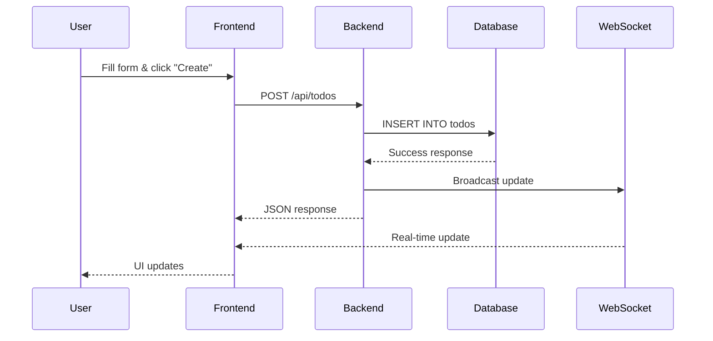
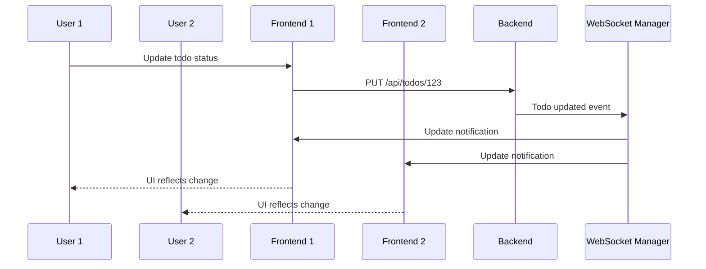

# 🏗️ Architecture Overview

This document provides a comprehensive overview of the Raspberry Pi Todo Application architecture.

## 🌐 System Architecture

```
┌─────────────────────────────────────────────────────────────────────────────────┐
│                              User Interface Layer                               │
├─────────────────────────────────────────────────────────────────────────────────┤
│  📱 Web Browser                                                                 │
│  ├── React SPA (TypeScript)                                                    │
│  ├── Real-time WebSocket Connection                                            │
│  └── REST API Client                                                           │
└─────────────────────────────────────────────────────────────────────────────────┘
                                    │ HTTP/WebSocket
                                    ▼
┌─────────────────────────────────────────────────────────────────────────────────┐
│                             Reverse Proxy (Optional)                           │
├─────────────────────────────────────────────────────────────────────────────────┤
│  🌐 Nginx                                                                       │
│  ├── SSL/TLS Termination                                                       │
│  ├── Static File Serving                                                       │
│  └── Load Balancing                                                            │
└─────────────────────────────────────────────────────────────────────────────────┘
                                    │ HTTP/WebSocket
                                    ▼
┌─────────────────────────────────────────────────────────────────────────────────┐
│                              Application Layer                                 │
├─────────────────────────────────────────────────────────────────────────────────┤
│  🦀 Rust Backend (Axum Framework)                                              │
│  ├── 📡 REST API Endpoints                                                     │
│  │   ├── GET  /api/todos                                                       │
│  │   ├── POST /api/todos                                                       │
│  │   ├── PUT  /api/todos/:id                                                   │
│  │   └── DELETE /api/todos/:id                                                 │
│  ├── 🔌 WebSocket Handler                                                       │
│  │   ├── Real-time Updates                                                     │
│  │   ├── Connection Management                                                 │
│  │   └── Message Broadcasting                                                  │
│  ├── 🗄️ Database Layer                                                          │
│  │   ├── SQLx (Compile-time SQL)                                               │
│  │   ├── Connection Pooling                                                    │
│  │   └── Migration Management                                                  │
│  ├── 📊 Monitoring & Health                                                     │
│  │   ├── Health Check Endpoint                                                 │
│  │   ├── Metrics Collection                                                    │
│  │   └── Structured Logging                                                    │
│  └── 🔒 Security                                                                │
│      ├── Input Validation                                                      │
│      ├── CORS Configuration                                                    │
│      └── Error Handling                                                        │
└─────────────────────────────────────────────────────────────────────────────────┘
                                    │ SQL Queries
                                    ▼
┌─────────────────────────────────────────────────────────────────────────────────┐
│                               Data Layer                                       │
├─────────────────────────────────────────────────────────────────────────────────┤
│  🗃️ SQLite Database                                                             │
│  ├── todos table                                                               │
│  │   ├── id (INTEGER PRIMARY KEY)                                             │
│  │   ├── title (TEXT NOT NULL)                                                │
│  │   ├── note (TEXT)                                                          │
│  │   ├── status (TEXT DEFAULT 'todo')                                         │
│  │   ├── priority (INTEGER DEFAULT 1)                                         │
│  │   ├── due_at (TEXT)                                                        │
│  │   ├── created_at (TEXT DEFAULT CURRENT_TIMESTAMP)                          │
│  │   ├── updated_at (TEXT DEFAULT CURRENT_TIMESTAMP)                          │
│  │   └── deleted (INTEGER DEFAULT 0)                                          │
│  ├── Database File: ./data/todos.db                                            │
│  ├── Automatic Migrations                                                      │
│  └── WAL Mode (Write-Ahead Logging)                                            │
└─────────────────────────────────────────────────────────────────────────────────┘
```

## 🔄 Data Flow

### 1. API Request Flow

```
Client Request → [Nginx] → Axum Router → Handler → Database → Response
```

### 2. WebSocket Update Flow

```
Database Change → WebSocket Manager → Connected Clients → UI Update
```

### 3. Real-time Synchronization

```
User Action → API Call → Database Update → WebSocket Broadcast → All Clients Update
```

## 🏗️ Component Architecture

### Frontend (React/TypeScript)

```
src/
├── App.tsx                 # Main application component
├── main.tsx               # Application entry point
├── types.ts               # TypeScript type definitions
├── api.ts                 # API client functions
├── ws.ts                  # WebSocket client class
└── pages/
    ├── Admin.tsx          # Todo management interface
    └── Display.tsx        # Read-only todo display
```

### Backend (Rust/Axum)

```
src/
├── main.rs                # Application entry point & server setup
├── routes.rs              # REST API route handlers
├── ws.rs                  # WebSocket handling
├── model.rs               # Data models & business logic
├── db.rs                  # Database layer & queries
└── error.rs               # Error types & handling
```

## 🐳 Deployment Architecture

### Docker Deployment

```
┌─────────────────────────────────────────────────────────────────────┐
│                         Docker Host                                │
├─────────────────────────────────────────────────────────────────────┤
│  🐳 Application Container                                           │
│  ├── Rust Binary (server-rs)                                       │
│  ├── Static Files (React build)                                    │
│  ├── SQLite Database Volume                                        │
│  └── Log Volume                                                    │
│                                                                     │
│  📊 Monitoring Stack (Optional)                                     │
│  ├── Prometheus (Metrics Collection)                               │
│  ├── Grafana (Dashboards)                                          │
│  ├── Promtail (Log Collection)                                     │
│  └── Node Exporter (System Metrics)                                │
└─────────────────────────────────────────────────────────────────────┘
```

### Systemd Deployment

```
┌─────────────────────────────────────────────────────────────────────┐
│                      Raspberry Pi OS                               │
├─────────────────────────────────────────────────────────────────────┤
│  🔧 Systemd Service                                                 │
│  ├── /opt/todo-app/server-rs (Binary)                              │
│  ├── /opt/todo-app/static/ (React build)                           │
│  ├── /opt/todo-app/data/ (SQLite database)                         │
│  ├── /opt/todo-app/logs/ (Application logs)                        │
│  └── /etc/systemd/system/todo-app.service                          │
└─────────────────────────────────────────────────────────────────────┘
```

## 🌊 Request/Response Flow

### Todo Creation



### Real-time Updates



## 📊 Technology Stack Details

### Performance Characteristics

- **Memory Usage**: ~20-50MB (Rust backend)
- **Startup Time**: ~500ms (native), ~2-3s (Docker)
- **Request Latency**: <10ms (typical API calls)
- **Concurrent Users**: 100+ (limited by Pi hardware)
- **Database Size**: Efficient (SQLite with WAL mode)

### Security Features

- **Input Validation**: Serde-based deserialization
- **SQL Injection Prevention**: SQLx compile-time checks
- **Memory Safety**: Rust's ownership system
- **No Buffer Overflows**: Rust prevents common C/C++ issues
- **CORS Configuration**: Configurable cross-origin policies

### Scalability Considerations

- **Horizontal Scaling**: Multiple Pi instances with load balancer
- **Database Scaling**: Consider PostgreSQL for high load
- **Caching**: In-memory caching for frequently accessed data
- **CDN**: Static assets can be served from CDN

## 🔧 Configuration Architecture

### Environment Variables

```
PORT=8000                  # Server port
RUST_LOG=info             # Logging level
DATABASE_URL=sqlite:...   # Database connection
STATIC_DIR=./static       # Static files directory
CORS_ORIGINS=*           # CORS allowed origins
```

### Build-time Configuration

```toml
# Cargo.toml features
[features]
default = ["sqlite"]
sqlite = ["sqlx/sqlite"]
postgres = ["sqlx/postgres"]
monitoring = ["metrics", "tracing"]
```

## 🚀 Performance Optimizations

### Rust Backend

- **Async/Await**: Non-blocking I/O operations
- **Connection Pooling**: Efficient database connections
- **Compile-time Optimizations**: Zero-cost abstractions
- **Memory Management**: No garbage collection overhead

### Frontend

- **Code Splitting**: Lazy loading with React Router
- **Tree Shaking**: Unused code elimination
- **Asset Optimization**: Compressed static files
- **Caching**: Browser and service worker caching

### Database

- **WAL Mode**: Better concurrent read performance
- **Indexes**: Optimized queries for common operations
- **Prepared Statements**: Query plan caching
- **Connection Reuse**: Persistent connections

## 🔍 Monitoring & Observability

### Application Metrics

- Request count and duration
- WebSocket connection count
- Database query performance
- Memory and CPU usage

### Health Checks

- `/api/health` - Application health
- Database connectivity
- File system access
- WebSocket functionality

### Logging

- Structured JSON logging
- Request/response tracing
- Error tracking and alerting
- Performance monitoring
